# Data Model

Seventeen DuckDB tables behind the use-case catalog, company case studies, market stats,
achievements, the agent/pattern catalog, the enterprise-AI-startup vendor catalog, and the
business-needs/tool-agnostic-pattern catalog. Schema defined in
[`src/storage.py`](../src/storage.py)'s `init_db()`; database file at
`data/processed/usecases.duckdb`; seeded from `data/seed/*.csv`.

**None of this is enforced by DuckDB** — every `CREATE TABLE` uses plain `INTEGER` columns with
no `FOREIGN KEY` constraints. Every relationship below is upheld by `storage.py`'s load/join
functions and by the seed order in `scripts/seed_db.py`, not by the database.

## Table categories

| Category | Tables |
|---|---|
| Entity (own primary key) | `ai_tooling_use_cases`, `company_case_studies`, `market_context`, `achievements`, `agents`, `agent_patterns`, `topics`, `enterprise_ai_startups`, `business_needs`, `tool_agnostic_use_cases` |
| Join (composite key of two FKs) | `ai_tooling_use_case_topics`, `ai_tooling_use_case_case_study_links`, `agent_pattern_links`, `business_need_use_case_links`, `business_need_pattern_links`, `pattern_use_case_links` |
| Derived (rebuilt from other tables) | `sources` |
| External config (not a DB table) | `config/taxonomy.yaml` — categories → tools, industries, departments, company_size_bands; loaded by `src/taxonomy.py` for dropdown suggestions only, not enforced |

## Entity-relationship diagram

Solid lines are the three real join-table relationships. Dashed lines are `sources`' derived,
polymorphic references — rebuilt from `source_url`/`source_type` on the three tables shown,
never stored as an actual foreign key.

```mermaid
erDiagram
    AI_TOOLING_USE_CASES ||--o{ AI_TOOLING_USE_CASE_TOPICS : "tagged with"
    TOPICS ||--o{ AI_TOOLING_USE_CASE_TOPICS : "applied to"
    AI_TOOLING_USE_CASES ||--o{ AI_TOOLING_USE_CASE_CASE_STUDY_LINKS : "evidenced by"
    COMPANY_CASE_STUDIES ||--o{ AI_TOOLING_USE_CASE_CASE_STUDY_LINKS : "supports"
    AGENTS ||--o{ AGENT_PATTERN_LINKS : "implements"
    AGENT_PATTERNS ||--o{ AGENT_PATTERN_LINKS : "used by"
    AI_TOOLING_USE_CASES ||..o{ SOURCES : "cited in, derived"
    COMPANY_CASE_STUDIES ||..o{ SOURCES : "cited in, derived"
    MARKET_CONTEXT ||..o{ SOURCES : "cited in, derived"
    BUSINESS_NEEDS ||..o{ SOURCES : "cited in, derived"
    TOOL_AGNOSTIC_USE_CASES ||..o{ SOURCES : "cited in, derived"
    BUSINESS_NEEDS ||--o{ BUSINESS_NEED_USE_CASE_LINKS : "directly addressed by"
    AI_TOOLING_USE_CASES ||--o{ BUSINESS_NEED_USE_CASE_LINKS : "directly addresses"
    BUSINESS_NEEDS ||--o{ BUSINESS_NEED_PATTERN_LINKS : "matches"
    TOOL_AGNOSTIC_USE_CASES ||--o{ BUSINESS_NEED_PATTERN_LINKS : "matched by"
    TOOL_AGNOSTIC_USE_CASES ||--o{ PATTERN_USE_CASE_LINKS : "implemented by"
    AI_TOOLING_USE_CASES ||--o{ PATTERN_USE_CASE_LINKS : "implements"

    AI_TOOLING_USE_CASES {
        int id PK
        string category
        string tool_name
        string vendor
        string use_case_title
        string use_case_description
        string target_users
        string maturity
        int business_value_score
        string business_value_rationale
        string roi_drivers
        string example_companies
        string source_url
        string source_type
        date collected_at
        date last_verified
        string notes
        date first_available
        string target_industries
        string target_departments
        string target_company_size
    }

    COMPANY_CASE_STUDIES {
        int id PK
        string company_name
        string industry
        string tool_or_platform
        string related_category
        string what_they_did
        string reported_efficiency_gain
        string gain_type
        string confidence
        string source_url
        string source_type
        date date_reported
        string notes
        string target_departments
        double financial_impact_usd
        string financial_impact_type
        string deployment_status
        string company_size_band
        double implementation_cost_usd
        string hq_region
    }

    MARKET_CONTEXT {
        int id PK
        string metric
        string value_display
        double value_numeric
        string unit
        string scope
        string context_category
        string time_period
        string source_url
        string source_type
        string confidence
        string notes
    }

    ACHIEVEMENTS {
        int id PK
        string title
        string achievement_type
        string tool_name
        string company_name
        string metric_display
        string description
        date date_achieved
        string source_url
        string source_type
        string confidence
        string notes
    }

    TOPICS {
        int id PK
        string name
        string description
    }

    AI_TOOLING_USE_CASE_TOPICS {
        int ai_tooling_use_case_id PK "references AI_TOOLING_USE_CASES"
        int topic_id PK "references TOPICS"
    }

    AI_TOOLING_USE_CASE_CASE_STUDY_LINKS {
        int ai_tooling_use_case_id PK "references AI_TOOLING_USE_CASES"
        int case_study_id PK "references COMPANY_CASE_STUDIES"
        string match_type
        string notes
    }

    AGENTS {
        int id PK
        string name
        string vendor
        string category
        string architecture_summary
        string autonomy_level
        string interface
        string open_source
        int release_year
        string description
        string source_url
        string source_type
        string notes
    }

    AGENT_PATTERNS {
        int id PK
        string name
        string description
        string when_it_works_well
        string source_url
        string source_type
    }

    AGENT_PATTERN_LINKS {
        int agent_id PK "references AGENTS"
        int pattern_id PK "references AGENT_PATTERNS"
        string notes
    }

    SOURCES {
        int id PK
        string table_name "which table this cites, e.g. ai_tooling_use_cases"
        int record_id "polymorphic reference, not a real FK"
        string url
        string source_type
        date retrieved_at
        string notes
    }

    ENTERPRISE_AI_STARTUPS {
        int id PK
        string company_name
        string product_name
        string target_departments
        string what_they_do
        string target_company_size
        string engagement_model
        string pricing_signal
        string funding_stage
        string notable_customers
        string source_url
        string source_type
        string confidence
        date collected_at
        date last_verified
        string notes
        string hq_region
    }

    BUSINESS_NEEDS {
        int id PK
        string need_title
        string need_description
        string status "unmet | partially addressed | addressed"
        int business_value_score
        string business_value_rationale
        string source_url
        string source_type
        string confidence
        date collected_at
        date last_verified
        string notes
        string target_industries
        string target_departments
        string target_company_size
    }

    TOOL_AGNOSTIC_USE_CASES {
        int id PK
        string category
        string use_case_title
        string use_case_description
        string target_users
        string maturity
        int business_value_score
        string business_value_rationale
        string roi_drivers
        string example_companies
        string source_url
        string source_type
        date collected_at
        date last_verified
        string notes
        date first_available
        string target_industries
        string target_departments
        string target_company_size
    }

    BUSINESS_NEED_USE_CASE_LINKS {
        int business_need_id PK "references BUSINESS_NEEDS"
        int ai_tooling_use_case_id PK "references AI_TOOLING_USE_CASES"
        string match_type
        string notes
    }

    BUSINESS_NEED_PATTERN_LINKS {
        int business_need_id PK "references BUSINESS_NEEDS"
        int tool_agnostic_use_case_id PK "references TOOL_AGNOSTIC_USE_CASES"
        string notes
    }

    PATTERN_USE_CASE_LINKS {
        int tool_agnostic_use_case_id PK "references TOOL_AGNOSTIC_USE_CASES"
        int ai_tooling_use_case_id PK "references AI_TOOLING_USE_CASES"
        string match_type
        string notes
    }
```

## Field notes

**Three tiers of specificity: need → pattern → tool-mapped use case.**
`ai_tooling_use_cases` requires a `tool_name` on every row — there was previously no way to
record a business problem that no cataloged tool addresses yet, or a proven solution *shape* that
several different tools implement. Two tables fix that, both consumed by
`pages/9_Business_Needs_and_Patterns.py`:
- `business_needs` — a raw business problem/opportunity. No `category`/`maturity`/`tool_name`,
  because those describe a solution, not the problem itself. `status` (`unmet` / `partially
  addressed` / `addressed`) is hand-set, the same convention as `deployment_status` elsewhere —
  it is *not* derived from whether a link row exists.
- `tool_agnostic_use_cases` — a generic, proven use-case pattern (e.g. "AI-assisted code review"),
  independent of any vendor. Its columns are deliberately identical to
  `ai_tooling_use_cases` minus `tool_name`/`vendor`, so every generic function in
  `src/analysis/summaries.py` (`counts_by_category`, `avg_score_by_*`,
  `industry_department_matrix`, `opportunity_finder`, `growth_forecast`, `maturity_readiness`)
  works unmodified on either table's dataframe.

Three join tables connect them into the existing graph: `business_need_pattern_links` (a need
matches a generic pattern), `pattern_use_case_links` (a pattern is implemented by one or more
specific tool-mapped use cases), and `business_need_use_case_links` (a shortcut for a need solved
directly by a specific tool, skipping the pattern step). As of the initial build, all five of
these new tables start **empty** — schema and seeding wired up, ready for real data to be added to
`data/seed/business_needs_seed.csv` / `tool_agnostic_use_cases_seed.csv` and their three link
CSVs. Unlike `ai_tooling_use_case_case_study_links_seed.csv` (which joins on raw ids),
the three new link CSVs join on human-readable titles/names — the same convention
`agent_pattern_links_seed.csv` uses — since these are meant to be hand-authored later.

**`enterprise_ai_startups` tracks vendors, not customers — deliberately unlinked.**
`company_case_studies` tracks companies that *use* AI tools; `enterprise_ai_startups` tracks the
*vendors/startups* that build non-engineering enterprise-workflow AI (finance, sales, support,
legal, HR — coding/dev-agent startups are already covered by `agents`). No join table connects
them; `pages/8_Startup_Vendors.py` cross-references by matching `company_case_studies.tool_or_platform`
against a startup's name at read time, the same "don't add a join table when a read-time lookup
suffices" call made for `sources`. `engagement_model` is the field this table exists for — what a
prospect actually has to do to engage each vendor (self-serve signup vs. fully sales-gated demo).

**Company size and cost are asymmetric fields, on purpose.**
`ai_tooling_use_cases.target_company_size` is semicolon-separated (like `target_industries`) since
one tool/use case can fit many size bands; `company_case_studies.company_size_band` is a single
value since one case study is about one company. `implementation_cost_usd` mirrors
`financial_impact_usd`'s "hard number or NULL, never invent" policy — as of the last reseed, **zero**
case studies disclose both a gain and a cost, so `src/analysis/summaries.py::net_roi()` (surfaced on
the Revenue & ROI+ page) is expected to render empty. That emptiness is itself the finding: public
AI case studies report the win far more often than the spend.

**`hq_region` lives only on the two single-company tables, not `ai_tooling_use_cases`.**
`company_case_studies.hq_region` and `enterprise_ai_startups.hq_region` are both real, verified
headquarters regions (`config/taxonomy.yaml`'s `regions` list) — one row is one company, so a
region is a fact. `ai_tooling_use_cases` deliberately has no equivalent field: its grain is
tool+use-case, not a single deploying entity, and as of this backfill every tracked tool vendor is
US-headquartered (no China-based vendor is in the catalog), so there's no real per-row geographic
signal to hang a region on there. As of the last reseed, `company_case_studies.hq_region` skews
North America (22/35) and Europe (11/35), with one Latin America and one Rest of Asia-Pacific row
and zero China/India — an honest reflection of which companies' AI deployments happen to be
publicly documented in English-language sources, not a claim about where AI adoption actually is
highest worldwide.

**No constraint enforces any of this.**
DuckDB's `CREATE TABLE` statements declare plain `INTEGER` columns — there isn't a single
`FOREIGN KEY` in the schema. Every relationship above is upheld by `storage.py`'s load/join
functions and by the seed order in `scripts/seed_db.py`, not by the database.

**`taxonomy.yaml` suggests, it doesn't constrain.**
`config/taxonomy.yaml` lists categories → tools plus 15 industries and 12 departments, loaded by
`src/taxonomy.py` purely for dropdown suggestions on `category`, `target_industries`, and
`target_departments`. None of it is enforced — free text is accepted everywhere.

**`sources` only knows about five tables.**
`backfill_sources_from_existing()` rebuilds `sources` from scratch every run, exploding the
semicolon-separated `source_url`/`source_type` on `ai_tooling_use_cases`, `company_case_studies`,
`market_context`, `business_needs`, and `tool_agnostic_use_cases`. `achievements`, `agents`, and
`agent_patterns` carry the same `source_url` column but are never included. Because it rebuilds
from whatever is already seeded, `scripts/seed_db.py` calls it **last**, after every other table
(including the two new ones and their links) has been seeded.

**Five seed files link by name, not id.**
`ai_tooling_use_case_topics_seed.csv` carries `topic_name`, `agent_pattern_links_seed.csv` carries
`agent_name`/`pattern_name`, and the three new business-need/pattern link CSVs
(`business_need_use_case_links_seed.csv`, `business_need_pattern_links_seed.csv`,
`pattern_use_case_links_seed.csv`) carry `need_title`/`pattern_title`/`tool_name`+`use_case_title`
— `storage.py` resolves all of these to ids with a SQL join at seed time, so their parent tables
must already be seeded first.

**Most of this isn't on screen yet.**
`ai_tooling_use_case_topics` and `ai_tooling_use_case_case_study_links` are rendered via their
joined loaders in `pages/3_Explore_Data.py` (the "Topics" column and "Related case studies"
section), `agent_pattern_links` in `pages/7_Agent_Catalog_and_Patterns.py`, and
`business_need_pattern_links`/`business_need_use_case_links`/`pattern_use_case_links` in
`pages/9_Business_Needs_and_Patterns.py`. `achievements` and `sources` still have loader functions
in `storage.py` with no page consuming them.

---

`src/storage.py` is the source of truth. `REQUIREMENTS.md` §3 documents only `ai_tooling_use_cases`,
`company_case_studies`, and `market_context` — the rest were added later, in code only.
