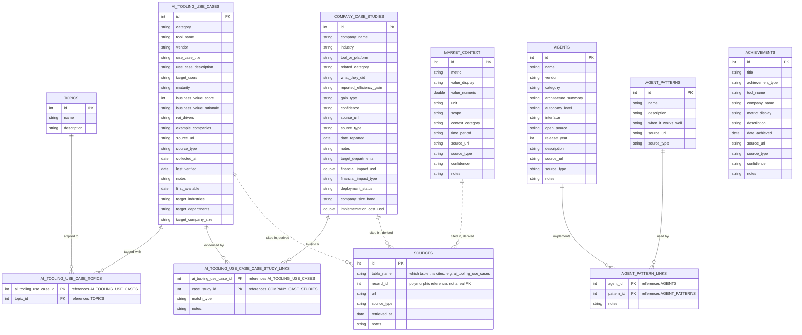

# Data Model

Eleven DuckDB tables behind the use-case catalog, company case studies, market stats,
achievements, and the agent/pattern catalog. Schema defined in [`src/storage.py`](../src/storage.py)'s
`init_db()`; database file at `data/processed/usecases.duckdb`; seeded from `data/seed/*.csv`.

**None of this is enforced by DuckDB** — every `CREATE TABLE` uses plain `INTEGER` columns with
no `FOREIGN KEY` constraints. Every relationship below is upheld by `storage.py`'s load/join
functions and by the seed order in `scripts/seed_db.py`, not by the database.

## Table categories

| Category | Tables |
|---|---|
| Entity (own primary key) | `ai_tooling_use_cases`, `company_case_studies`, `market_context`, `achievements`, `agents`, `agent_patterns`, `topics` |
| Join (composite key of two FKs) | `ai_tooling_use_case_topics`, `ai_tooling_use_case_case_study_links`, `agent_pattern_links` |
| Derived (rebuilt from other tables) | `sources` |
| External config (not a DB table) | `config/taxonomy.yaml` — categories → tools, industries, departments; loaded by `src/taxonomy.py` for dropdown suggestions only, not enforced |

## Entity-relationship diagram

Solid lines are the three real join-table relationships. Dashed lines are `sources`' derived,
polymorphic references — rebuilt from `source_url`/`source_type` on the three tables shown,
never stored as an actual foreign key.

## Field notes

**Company size and cost are asymmetric fields, on purpose.**
`ai_tooling_use_cases.target_company_size` is semicolon-separated (like `target_industries`) since
one tool/use case can fit many size bands; `company_case_studies.company_size_band` is a single
value since one case study is about one company. `implementation_cost_usd` mirrors
`financial_impact_usd`'s "hard number or NULL, never invent" policy — as of the last reseed, **zero**
case studies disclose both a gain and a cost, so `src/analysis/summaries.py::net_roi()` (surfaced on
the Revenue & ROI+ page) is expected to render empty. That emptiness is itself the finding: public
AI case studies report the win far more often than the spend.

**No constraint enforces any of this.**
DuckDB's `CREATE TABLE` statements declare plain `INTEGER` columns — there isn't a single
`FOREIGN KEY` in the schema. Every relationship above is upheld by `storage.py`'s load/join
functions and by the seed order in `scripts/seed_db.py`, not by the database.

**`taxonomy.yaml` suggests, it doesn't constrain.**
`config/taxonomy.yaml` lists categories → tools plus 15 industries and 12 departments, loaded by
`src/taxonomy.py` purely for dropdown suggestions on `category`, `target_industries`, and
`target_departments`. None of it is enforced — free text is accepted everywhere.

**`sources` only knows about three tables.**
`backfill_sources_from_existing()` rebuilds `sources` from scratch every run, exploding the
semicolon-separated `source_url`/`source_type` on `ai_tooling_use_cases`, `company_case_studies`, and
`market_context`. `achievements`, `agents`, and `agent_patterns` carry the same `source_url`
column but are never included.

**Two seed files link by name, not id.**
`ai_tooling_use_case_topics_seed.csv` carries `topic_name` and `agent_pattern_links_seed.csv` carries
`agent_name`/`pattern_name` — `storage.py` resolves both to ids with a SQL join at seed time, so
`topics` and `agents`/`agent_patterns` must already be seeded first.

**Most of this isn't on screen yet.**
`ai_tooling_use_case_topics` and `ai_tooling_use_case_case_study_links` are rendered via their
joined loaders in `pages/3_Explore_Data.py` (the "Topics" column and "Related case studies"
section), and `agent_pattern_links` in `pages/7_Agent_Catalog_and_Patterns.py`. `achievements` and
`sources` still have loader functions in `storage.py` with no page consuming them.

---

`src/storage.py` is the source of truth. `REQUIREMENTS.md` §3 documents only `ai_tooling_use_cases`,
`company_case_studies`, and `market_context` — the rest were added later, in code only.
